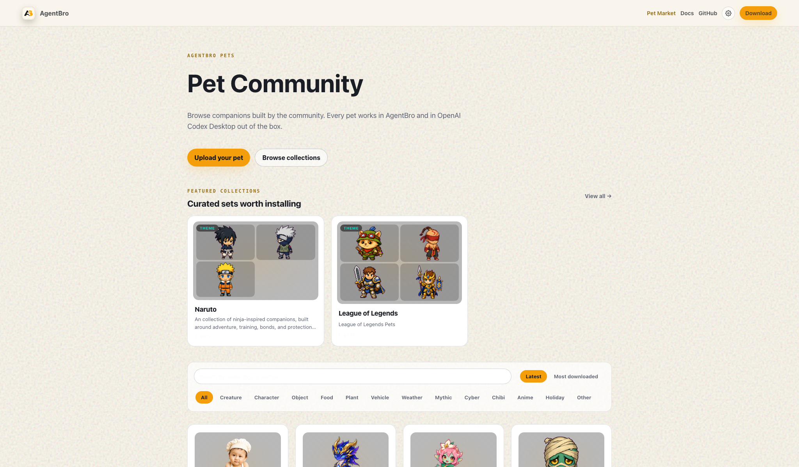
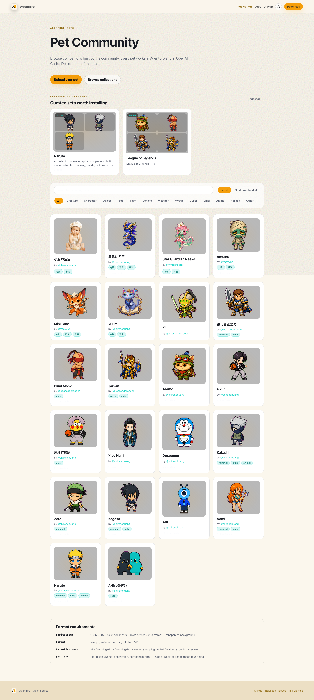

# AgentBroPet

AgentBroPet is a Codex skill for creating animated pets that work with [AgentBro](https://github.com/shirenchuang/agentbro) and OpenAI Codex Desktop.

It turns a concept, brand cue, reference image, or existing generated artwork into an app-ready pet package:

```text
pet.json
spritesheet.webp
```

The generated pets follow the same format used by the [AgentBro Pet Market](https://www.agentbro.net/pets): a transparent 8 x 9 animation atlas with `192x208` cells and the standard AgentBro/Codex states.

## Links

- AgentBro open-source project: [github.com/shirenchuang/agentbro](https://github.com/shirenchuang/agentbro)
- Author / open-source home: [github.com/shirenchuang](https://github.com/shirenchuang)
- AgentBro Pet Market: [agentbro.net/pets](https://www.agentbro.net/pets)
- This skill repo: [github.com/shirenchuang/agentbro-pet](https://github.com/shirenchuang/agentbro-pet)

## Pet Market

Browse, install, and share community pets in the AgentBro pet market:





## What This Skill Does

AgentBroPet keeps the deterministic hatch-pet pipeline, but removes the hard dependency on Codex's native `$imagegen` skill. It can use whatever image-generation backend is available in the current agent environment:

- Codex `$imagegen`
- another installed image-generation skill
- OpenAI image CLI/API such as `gpt-image-2`
- Nano Banana / Gemini / Flux / ComfyUI / Midjourney-style external workflows
- a manual backend where another agent or model generates the PNGs and returns local file paths

The key idea is simple: image generation is replaceable, but atlas assembly and QA stay deterministic.

## Output Format

Final pet packages contain:

```text
<pet-id>/
├── pet.json
└── spritesheet.webp
```

The atlas contract:

- `1536x1872` pixels
- 8 columns x 9 rows
- `192x208` pixels per cell
- transparent background
- unused cells fully transparent
- WebP or PNG atlas

Animation rows:

```text
0 idle
1 running-right
2 running-left
3 waving
4 jumping
5 failed
6 waiting
7 running
8 review
```

## Install

Clone this repo into your Codex skills folder:

```bash
mkdir -p ~/.codex/skills
git clone https://github.com/shirenchuang/agentbro-pet.git ~/.codex/skills/agentbro-pet
```

Then invoke the skill in Codex:

```text
$AgentBroPet create a Teemo-inspired scout pet for AgentBro
```

For non-Codex agents, use the same folder as a workflow package. The agent only needs to run the scripts, read `imagegen-jobs.json`, generate the requested images, and copy selected outputs into the decoded paths.

## Basic Workflow

Prepare a pet run:

```bash
SKILL_DIR="$HOME/.codex/skills/agentbro-pet"

python3 "$SKILL_DIR/scripts/prepare_pet_run.py" \
  --pet-name "My Pet" \
  --pet-notes "a tiny friendly coding companion" \
  --output-dir ./output/agentbro-pet/my-pet \
  --style-preset auto \
  --force
```

Inspect ready visual jobs:

```bash
jq '.jobs[] | {id, status, depends_on, prompt_file, input_images, output_path}' \
  ./output/agentbro-pet/my-pet/imagegen-jobs.json
```

Generate each ready job with your available image backend, copy the selected result into the job's `output_path`, then mark the job complete in `imagegen-jobs.json`.

When all jobs are complete, run the deterministic pipeline:

```bash
RUN_DIR=./output/agentbro-pet/my-pet

python3 "$SKILL_DIR/scripts/extract_strip_frames.py" \
  --decoded-dir "$RUN_DIR/decoded" \
  --output-dir "$RUN_DIR/frames" \
  --states all \
  --method auto

python3 "$SKILL_DIR/scripts/inspect_frames.py" \
  --frames-root "$RUN_DIR/frames" \
  --json-out "$RUN_DIR/qa/review.json" \
  --require-components

python3 "$SKILL_DIR/scripts/compose_atlas.py" \
  --frames-root "$RUN_DIR/frames" \
  --output "$RUN_DIR/final/spritesheet.png" \
  --webp-output "$RUN_DIR/final/spritesheet.webp"

python3 "$SKILL_DIR/scripts/validate_atlas.py" \
  "$RUN_DIR/final/spritesheet.webp" \
  --json-out "$RUN_DIR/final/validation.json"

python3 "$SKILL_DIR/scripts/make_contact_sheet.py" \
  "$RUN_DIR/final/spritesheet.webp" \
  --output "$RUN_DIR/qa/contact-sheet.png"

python3 "$SKILL_DIR/scripts/render_animation_previews.py" \
  --frames-root "$RUN_DIR/frames" \
  --output-dir "$RUN_DIR/qa/previews"
```

## Backend Contract

Every image backend must:

- read each job's prompt file
- use the listed input images whenever references are supported
- generate one selected PNG for the base or row strip
- return a local `selected_source` path
- never use layout guides as final output
- never copy guide boxes, blue safety frames, labels, or center lines into generated rows
- keep the pet identity consistent across all rows

`imagegen-jobs.json` keeps its historical name, but in AgentBroPet it means "visual generation jobs"; it is not tied to Codex `$imagegen`.

## Quality Gates

Do not accept a pet until:

- `qa/review.json` has no errors
- `final/validation.json` passes
- `qa/contact-sheet.png` has been visually checked
- `qa/previews/*.gif` have been visually checked
- all rows preserve the same pet identity, style, palette, silhouette, and props
- directional rows face the correct direction
- idle is not visually inert
- no row contains guide marks, detached effects, white cell backgrounds, cropped sprites, or obvious size popping

## License

Apache-2.0. See [LICENSE.txt](LICENSE.txt).
